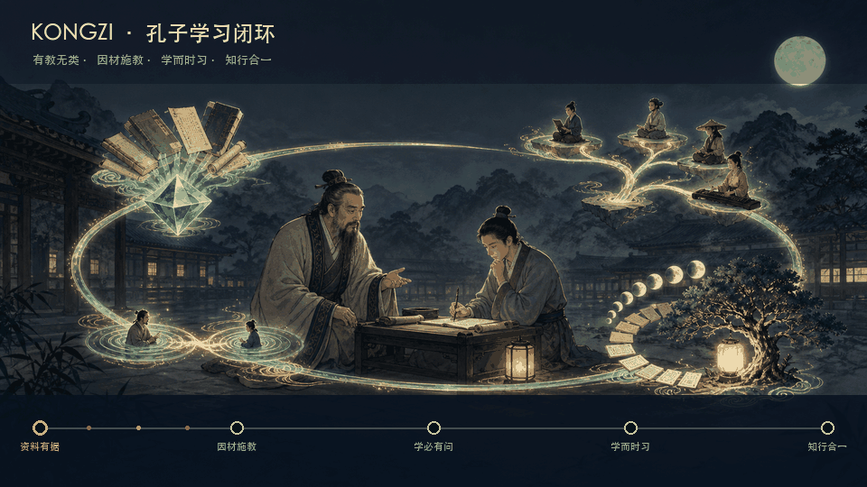
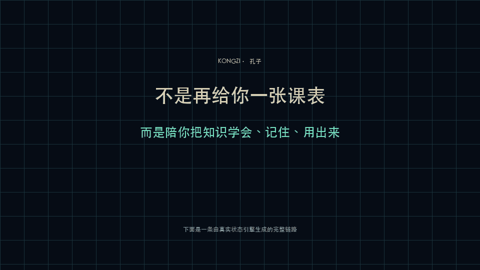

<div align="center">

# Kongzi.skill

<p align="center">
  
  <br/>
  <sub>因材施教 · 学而时习 · 知行合一</sub>
</p>

> *「不愤不启，不悱不发。举一隅不以三隅反，则不复也。」*

[](LICENSE)
[](https://agentskills.io)
[](https://skills.sh)
[](https://github.com/atlax-tech/kongzi-ai-mentor-skills/actions/workflows/test.yml)
[](#安装)

<br>

**Kongzi 把任意知识方向变成一条真正属于你的学习路线：依据资料构建知识地图，由 AI 像老师一样提问、等待你作答、纠错、复习，并把过程沉淀到 Obsidian。**

<sub>基于开放的 [Agent Skills 协议](https://agentskills.io)，可在 Claude Code、Codex、Cursor、OpenClaw、Hermes Agent、Gemini CLI、OpenCode 等兼容 runtime 中运行。</sub>

<br>

它不会一上来丢给你一份漂亮的课程表。<br>
它先确认你想做到什么、现在会什么、有哪些材料和限制。<br>
然后让每个知识点有出处、每段路线有依据、每次学习有输出、每次掌握有延迟证据。

[看效果](#效果示例) · [安装](#安装) · [使用](#使用) · [它覆盖什么](#kongzi-覆盖什么) · [学习方法](#学习方法如何选择)

<br>

[English summary](#english)

</div>

---

## 效果示例

<p align="center">
  
  <br/>
  <sub>不是命令截图轮播：动图由真实临时 Obsidian vault 和完整学习链路生成</sub>
</p>

```
用户      ❯ /Kongzi 我想用 4 周学会 SQL，每天 30 分钟，完全没基础

Kongzi    ❯ 先定义“学会”，再设计路线。

            第一个问题：
            4 周后，你最希望能独立完成哪件事？
            A. 看懂并修改查询
            B. 从零分析一份业务数据
            C. 应付面试或考试
            D. 其他具体产出
```

```
用户      ❯ /Kongzi study

Kongzi    ❯ 今天不先讲解。请闭卷写出：
            如何求每个客户的订单总额？为什么需要 GROUP BY？

用户      ❯ SELECT customer_id, SUM(amount)
            FROM orders GROUP BY customer_id;
            因为要按客户分别聚合。

Kongzi    ❯ 已先保存你的原始作答。
            准确度 0.92 · 提取 0.90 · 迁移 0.78

            核心正确。现在追问一个新情境：
            如果要按客户和月份分别聚合，你会改哪两处？
```

```
用户      ❯ /Kongzi

Kongzi    ❯ 已恢复「SQL 业务分析」。
            今天有 3 张复习卡到期，上次薄弱点是窗口函数与聚合的边界。

            唯一下一步：先完成 8 分钟延迟复习，再进入新节点。
```

Kongzi 不把“看懂了”当作“掌握了”。用户必须亲自输出；即时作答、延迟提取和迁移应用会分别保存。

---

## 安装

Kongzi 基于开放的 [Agent Skills](https://agentskills.io) 协议，可在任何 skills-compatible 的 AI Agent runtime 中运行。

### 方式一：一行命令（推荐，跨 runtime）

打开你正在使用的 Agent，告诉它：

```
帮我安装这个 skill：https://github.com/atlax-tech/kongzi-ai-mentor-skills
```

或者使用通用 CLI：

```bash
npx skills add atlax-tech/kongzi-ai-mentor-skills
```

安装完成后，直接输入 `/Kongzi`。

### 方式二：手动安装

<details>
<summary>展开查看各 runtime 的 skills 目录</summary>

| Runtime | 安装路径 |
|---|---|
| Claude Code | `~/.claude/skills/kongzi/` |
| Codex CLI | `~/.codex/skills/kongzi/` |
| Cursor | `~/.cursor/skills/kongzi/` |
| OpenClaw | `~/.openclaw/workspace/skills/kongzi/` |
| 其他 runtime | clone 到对应 runtime 的 `skills/` 目录 |

```bash
git clone https://github.com/atlax-tech/kongzi-ai-mentor-skills <对应的 skills 路径>
```

</details>

### 方式三：作为参考资料使用

如果 runtime 不能自动加载 Agent Skills，可以把 `SKILL.md` 交给 Agent，并在仓库中运行：

```bash
python3 scripts/kongzi.py --help
```

核心学习状态引擎只依赖 Python 标准库。

---

### 使用

在你的 Obsidian vault 中打开 Agent：

```
> /Kongzi
> /Kongzi 我想在 6 周内学会统计学，每天 40 分钟
> /Kongzi resume
```

录入你信任的资料：

```
> /Kongzi source 把这本 PDF 作为主资料
> /Kongzi source 抓取这篇官方文档
> /Kongzi source 导入这份视频转录
```

学习、提问与复习：

```
> /Kongzi roadmap
> /Kongzi study
> /Kongzi 我不理解这个知识点，请结合资料解释
> /Kongzi quiz
> /Kongzi review
> /Kongzi reminder 每天晚上 8 点提醒我
```

查看或迁移进度：

```
> /Kongzi status
> /Kongzi report daily
> /Kongzi report weekly
> /Kongzi bundle 导出我的完整学习记录
```

输入 `/Kongzi` 会先恢复本地状态：有未完成会话就继续，有到期复习就优先复习，否则只给一个明确的下一步。

---

## Kongzi 覆盖什么

| 能力 | 你会得到什么 |
|---|---|
| **学习者画像** | 逐题确认目标、基础、时间、限制、材料、经验与诊断表现 |
| **资料证据** | 本地文件或公开网页的来源记录、内容哈希、访问时间与可回查定位 |
| **知识地图** | 按知识类型拆分节点，标注前置依赖、引用依据和掌握标准 |
| **个性路线** | 结合目标、画像、材料和真实表现生成周期、顺序与每次必须产出 |
| **耐心讲解** | 回答学习者的具体疑问，限定资料范围，解释后立即要求复述或应用 |
| **老师式提问** | 先闭卷输出，再保存原答、评分、纠错，并追问变式和迁移 |
| **自适应复习** | 根据作答证据安排延迟提取；失败会缩短间隔并保留历史 |
| **诚实掌握** | 即时高分只代表“这次会做”；延迟提取与应用均通过才算掌握 |
| **过程沉淀** | 在 Obsidian 保存来源、路线、计划、问答、复习、日报与周报 |
| **持续恢复** | 每次继续时恢复活动会话、到期复习、薄弱点和唯一下一步 |
| **提醒与迁移** | 生成本地提醒定义；学习记录可校验导出、导入与修复 |

### 诚实边界

- 没有录入或抓取到的材料，不会被伪装成权威知识。
- 搜索摘要、模型记忆和导师口吻都不能代替来源正文。
- 资料之间存在冲突时会显式保留冲突，不会强行合成一个“标准答案”。
- 费曼式解释适合暴露理解缺口，但不替代操作练习、反馈、延迟复习和真实项目。
- 学习偏好只用于提高便利性，不会把用户固定成某种未经证实的“学习风格”。
- 短期对话流畅不等于长期有效；真正的学习效果需要在现实周期中接受延迟检验。

**一个不保存用户原始输出、不区分即时流畅与延迟掌握的学习 Skill，不值得信任。**

---

## 已集成能力

### 完整运行时集成

Kongzi 对用户只呈现一套统一学习流程。本 README 不展开其他开源项目的安装方式或功能说明；以下项目只作致谢与来源声明，详情请阅读各自仓库：

- [kangarooking/cangjie-skill](https://github.com/kangarooking/cangjie-skill)
- [alchaincyf/nuwa-skill](https://github.com/alchaincyf/nuwa-skill)
- [alchaincyf/darwin-skill](https://github.com/alchaincyf/darwin-skill)
- [kangarooking/kangarooking-skills · video-downloader](https://github.com/kangarooking/kangarooking-skills/tree/main/video-downloader)

### 构建参考

感谢以下公开项目提供的设计启发。此处同样只声明引用，不复述其实现或用法：

- [atlax-tech/harness-armor](https://github.com/atlax-tech/harness-armor)
- [iamzifei/show-me-the-money](https://github.com/iamzifei/show-me-the-money)
- [XBuilderLAB/cheat-on-content](https://github.com/XBuilderLAB/cheat-on-content)

---

## 贡献与社区

Kongzi 是 MIT 开源项目。欢迎提交：

- 一个真实学习旅程中卡住的场景
- 新领域的权威来源选择规则
- 更好的诊断题、迁移题和评分标准
- 不同 runtime 与 Obsidian 工作流的兼容性修复
- 能以可重复测试证明有效的改进

提交前请运行：

```bash
python3 -m unittest discover -s tests -v
python3 scripts/kongzi.py doctor --vault <测试 vault>
```

---

## Darwin.skill：让 Kongzi 持续进化

Kongzi 感谢 [alchaincyf/darwin-skill](https://github.com/alchaincyf/darwin-skill) 对本项目的启发与支持。为保持 README 聚焦，这里只作致谢与来源声明；安装、能力和使用方式请以原项目文档为准。

---

## 学习方法如何选择

Kongzi 不押注单一学习法，而是按知识类型组合方法：

**1. 事实与术语**——提取练习 + 间隔复习 + 相似概念辨析。

**2. 概念与心智模型**——例子/反例 + 自我解释 + 闭卷提取 + 新情境迁移。

**3. 操作与解题程序**——完整示例 → 补全步骤 → 独立练习 → 变式应用 → 反馈纠错。

**4. 感知与分类判断**——对比案例 + 交错练习 + 快速反馈。

**5. 创作与职业能力**——拆分子技能 + 刻意练习 + 真实项目 + 评审 + 反思。

**6. 隐性经验**——专家示范 + 教练提示 + 脚手架逐步撤除 + 真实任务。

核心依据包括提取练习、间隔效应、交错练习、完整示例、自我解释、精细加工、双重编码、刻意练习、掌握学习、认知学徒制、项目式学习和元认知校准。

费曼式解释适合检查“能否用自己的话说清楚”，但不能独自承担所有学习：会解释游泳原理不等于会游泳，会复述 API 不等于能调试程序。

---

## 仓库结构

```text
kongzi-ai-mentor-skills/
├── SKILL.md                 # /Kongzi 根路由与老师行为契约
├── skills/                  # 画像、来源、路线、学习、复习、报告
├── scripts/
│   ├── kongzi.py            # 本地状态、证据、计划、问答、复习与报告
│   ├── render_hero.py       # 可重复生成理念动图
│   └── render_demo.py       # 运行真实链路并生成 Demo
├── references/              # Agent 按需读取的学习与证据协议
├── assets/                  # Hero、Demo 与生成源图
├── tests/                   # 状态不变量和完整学习链路测试
├── agents/openai.yaml
├── README.md
└── LICENSE
```

学习内容保存在你自己的 Obsidian vault：机器状态位于 `.kongzi/`，可阅读笔记位于 `Kongzi/`。

---

## 背后的故事

很多 AI 学习助手擅长一次性讲解，却不知道用户昨天学了什么、是否真的回答过、三天后是否还记得，也无法说明答案来自哪里。

Kongzi 的出发点很朴素：少报一门不需要的课，少在零散内容里兜圈子，把时间花在真正的输出、纠错和复习上。

**Kongzi（孔子）**代表的不是复古课堂，而是“因材施教”和“学而时习”：路线因人而异，资料可以回查，学习必须经过用户自己的嘴、手和脑。

---

## 许可证

[MIT](LICENSE)

---

<div align="center">

感谢所有被引用的开源项目与研究工作。<br>
如果 Kongzi 帮你少踩了一次学习的坑，欢迎给个 Star。

</div>

---

## English

**Kongzi is a local-first, source-grounded AI learning mentor for any subject.** It builds a learner profile, registers authoritative materials, creates a prerequisite-aware knowledge map, schedules a personalized study cycle, asks the learner to produce answers, records and corrects them, schedules spaced reviews, and writes durable progress plus daily/weekly reports into Obsidian.

**Install:** `npx skills add atlax-tech/kongzi-ai-mentor-skills`

**Start or resume:** `/Kongzi`

Kongzi does not treat fluent conversation as mastery: claims require inspectable source locators, learner answers are stored before feedback, and mastery requires delayed retrieval plus application evidence.

Acknowledgements and source declarations: [cangjie-skill](https://github.com/kangarooking/cangjie-skill), [nuwa-skill](https://github.com/alchaincyf/nuwa-skill), [darwin-skill](https://github.com/alchaincyf/darwin-skill), [video-downloader](https://github.com/kangarooking/kangarooking-skills/tree/main/video-downloader), [harness-armor](https://github.com/atlax-tech/harness-armor), [show-me-the-money](https://github.com/iamzifei/show-me-the-money), and [cheat-on-content](https://github.com/XBuilderLAB/cheat-on-content).
