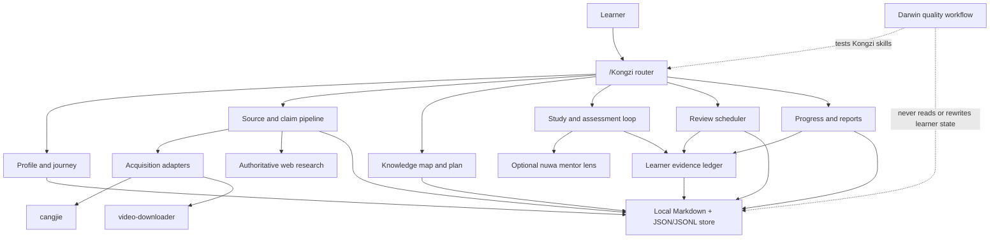

# Architecture

Status: INFERRED proposed architecture; no implementation exists

## Purpose

Define a skill-first architecture that can implement the confirmed PRD without
making chat history, a model's memory, or a simulated mentor the source of
truth.

## Current state

The repository contains product documents and a managed Harness. There is no
business code, package manifest, runtime adapter, schema implementation, test
runner, or install command.

## Architectural drivers

1. Local-first, inspectable persistence inside an Obsidian-compatible workspace.
2. Source and claim provenance for every factual learning artifact.
3. Deterministic resume, review scheduling, and reporting across agent sessions.
4. One router with independently testable specialist skills.
5. Swappable acquisition, mentor, scheduler, and runtime adapters.
6. Strict separation between learner evidence and AI-generated content.
7. Reuse of the named upstream skills without letting them bypass Kongzi's
   evidence model.

## Proposed component model



## Proposed repository module map

This is a target layout, not current implementation:

```text
SKILL.md                          # Kongzi router
skills/
  kongzi-start/SKILL.md
  kongzi-profile/SKILL.md
  kongzi-sources/SKILL.md
  kongzi-map/SKILL.md
  kongzi-plan/SKILL.md
  kongzi-study/SKILL.md
  kongzi-quiz/SKILL.md
  kongzi-review/SKILL.md
  kongzi-mentor/SKILL.md
  kongzi-note/SKILL.md
  kongzi-progress/SKILL.md
  kongzi-report/SKILL.md
  kongzi-status/SKILL.md
  kongzi-resume/SKILL.md
shared/
  references/                    # protocols and method selection
  schemas/                       # durable-state contracts
  scripts/                       # deterministic validation and maintenance
  templates/                     # Obsidian notes and reports
integrations/
  cangjie/
  video-downloader/
  nuwa/
  darwin/
tests/
  fixtures/
  evals/
```

The exact packaging layout remains UNRESOLVED until the first implementation
phase tests Agent Skills discovery in the target runtimes.

## Runtime flow

### 1. Route

The router resolves workspace, loads `.kongzi/state.json`, validates it, selects
one journey, surfaces due work, and invokes one specialist. It does not perform
all specialist logic itself.

### 2. Gather evidence

Source intake creates a source record before extraction. Long-form and video
adapters return artifacts with provenance. Web search returns candidates; the
underlying source must be read before a claim is accepted.

### 3. Build learning state

Claims map to stable knowledge-node IDs. Nodes map to prerequisite edges,
mastery rubrics, learner attempts, and scheduled reviews.

### 4. Run an active loop

Study and quiz skills select a node and task, capture learner response and
confidence, compare against a source-backed rubric, require correction, and
append evidence.

### 5. Schedule and report

The review engine writes due items independently of notification delivery.
Reports read persisted events and evidence, never conversation memory.

## Data ownership and boundaries

| Data | Canonical owner | Mutation rule |
| --- | --- | --- |
| Product requirements | `docs/product/PRD_v0.1.md` | User-owned; explicit product change only |
| Learning-science evidence | `docs/research/LEARNING_SCIENCE.md` | Evidence-reviewed change |
| Learner profile | Vault Markdown plus event history | User-editable; agent changes are auditable |
| Sources and claims | Journey source/claim records | Add or supersede; do not silently overwrite |
| Learner answers | Session and assessment records | Append-only evidence |
| Mastery state | Derived from evidence | Rebuildable; never sole evidence |
| Review queue | Machine index with linked events | Deterministic and rebuildable |
| Reports | Dated Markdown artifacts | Append-only |
| Mentor skills | Integration artifact | Cannot mutate evidence or grading |
| Darwin results | Repository development artifact | Cannot touch a user's vault |

## Required invariants

- No accepted factual claim without a readable source record and locator.
- No session completion without learner output.
- No `mastered` transition from one immediate answer.
- No reminder marks a review complete.
- No persona changes the factual answer key or rubric.
- No machine index is the only copy of learner evidence.
- No adapter may report an artifact it did not produce.
- No development workflow writes directly to protected `main`.

## State and schema strategy

The PRD's `.kongzi/` and `Kongzi/` layout is the current design authority.
Implementation should use:

- stable IDs independent of filenames;
- ISO 8601 timestamps with timezone;
- explicit schema versions;
- append-only event JSONL;
- human-readable Markdown artifacts;
- rebuildable JSON indexes;
- atomic writes where supported;
- backup plus validation before migration.

Precise JSON schemas are UNRESOLVED and belong to the first implementation
decision.

## Adapter contracts

### Acquisition

An acquisition adapter accepts a registered source and returns actual artifact
paths, metadata, extraction engine/version, locators, and failure details.
Adapters never return an unverified “success.”

### Mentor

A mentor adapter returns a perspective skill and its provenance. The learning
loop labels its output `MENTOR LENS` and keeps source resolution outside the
persona.

### Scheduler

The core engine owns due-state. Runtime automation, `launchd`, and session-start
hooks are delivery adapters. A delivery failure does not lose the item.

### Quality

Darwin operates on repository skills and test prompts in a development branch.
It has no path to the user's learning-data root.

## Security and data considerations

- Default persistence is local.
- Credentials for web or ASR adapters must not enter learning notes, reports,
  source archives, fixtures, or Git history.
- Local sources may be sensitive; generated reports must cite paths without
  copying unnecessary content.
- Symlink traversal outside the chosen vault/source boundary must be rejected.
- Unknown repository or source scripts are not executed merely because a
  source package contains them.

## Key unresolved decisions

- Schema shapes and migration tool.
- First supported runtime and packaging installer.
- Reminder delivery adapter selected for v0.1.
- Whether upstream skills are vendored, installed as peers, or wrapped through
  discovery; full capability integration remains required.
- Exact source parsers for PDF, EPUB, and web pages.
- How mastery rubrics are represented across knowledge types.

## Sources

- `docs/product/PRD_v0.1.md`
- `docs/research/LEARNING_SCIENCE.md`

